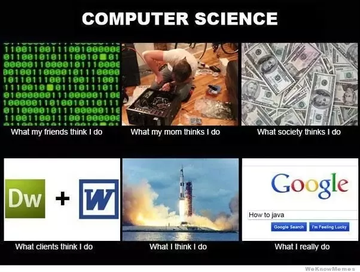

# Jason Wong's User Page
## This Github Page will contain links and pictures along with info about me.
### Basically just putting stuff so that I can use all the markdown goodies.

#### **Some stuff about me**

*Greetings!* My name is Jason Wong ~~not that that wasn't already obvious~~ and I am a third year student at UCSD.

I spend a lot of my time browsing Reddit, watching anime, and playing some gacha games. In fact, I probably spend too much time
doing things that aren't productive. As the legendary Hayao Miyazaki once said:

> Anime was a mistake.

Anyway, hopefully I can eventually stop procrastinating with this stuff and do real coding like
```
// baby's first code
print("Hello world");
```
Y'know the ***hardest and most difficult*** type of code.

One thing that I want to share is the best tool if you need help with code. When in doubt, just go [here](https://www.google.com/).
This is where you will find all the answers: to life, to death, and to hello world.



A list of languages that I have some experience with ~~doesn't mean I'm good with all of them~~:
- Java
- C
- C++
- Python
- Assembly

My to-do list for this quarter:
- [ ]  Don't fail horribly
- [ ]  Try not to procrastinate too much
- [X]  Avoid COVID

[Go back to top](#jason-wongs-user-page).
